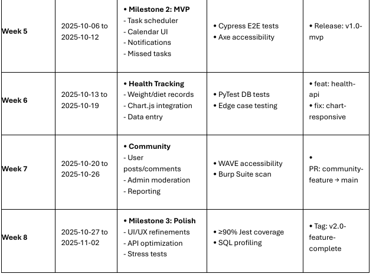

 Introduction & Project
======================

This video will cover the comprehensive:
Development Timeline

Progress Update: Weeks 5:
=========================
1. End-to-End (E2E) 
2. Accessibility testing

Progress Update: Weeks 6: I verified that health records could be created, read, updated, and deleted via the /health API endpoints.
=========================
1. showing the Health Tracking page
2. auto testing with GUI-based API testing using Postman (No coding required, visual results, professional industry tool).
3. Chart.js
4. Edge Case.

Progress Update: Weeks 7: (Community features, including user posts, comments, and admin moderation.)
=========================
1. showing the coumunity page
2.  WAVE accessibility  both automatic and manual
3. Burp Suite scan has been chnaged to ZAP scan (beneifits to use ZAP is that it is free and open source, and it is more up-to-date than Burp Suite).

Demonstration of Core Functionality
==================================
1. The Dashboard
2. Task Scheduler
3. The Calendar
4. Health Tracking
5. coumunity page
6. PROFILE page

Development Stack & Testing Architecture
================================
1. Task Scheduler - `npx cypress open`  (e2e + Accessibility testing)
2.  Health Tracking - GUI-based API testing using `Postman` (Health Record CRUD Operations(POST /health,GET /health/records,PUT /health/:id,DELETE /health/:id), Data Validation (user input), Database Integration,Chart.js Integration).
NOTE: MAKE SURE YOU login and get the cookie-id before testing the health tracking page.
3. The community -  `WAVE` accessibility both automatic + ZAP scan (manual + automated)
1. npm run test:week7
2. Open `C:\Users\Ali Dahche 1\Downloads\ZAP_2.16.1_Crossplatform\ZAP_2.16.1`
run ZAP.bat
quick scan on `https://petwell-a1271a0b47f3.herokuapp.com/community`

Walking Through the Cypress & Axe Tests
================================
1. I created a set of custom Cypress commands in `commands.js` to make tests more `reliable` and `readable`. For example, the `ultraSimpleLogin command` handles the `login process before each test suite runs`,
2. Task Scheduler Tests (`task-scheduler.cy.js` & `task-scheduler-accessibility.cy.js`). Functional Goal: Ensure `users can successfully schedule a new pet care task`.
3. Calendar UI Tests (`calendar-ui.cy.js` & `calendar-ui-accessibility.cy.js`). Functional Goal: `Verify the calendar` renders correctly and is interactive.

Code Example: A Hurdle Overcome
================================
# 1. inside `commands.js` i have

`Cypress.Commands.add('ultraSimpleLogin', (username = 'aliabdulsameea69@gmail.com', password = 'HawlerErbil6824!') => {cy.visit('/login');`
 i created `reliable, reusable login command`s that handle `real authentication`.

# 2. Real-time Community Comments with AJAX (Week 7) 

`const commentForms = document.querySelectorAll('.comment-form');commentForms.forEach(form => {form.addEventListener('submit' async function(e) {e.preventDefault();`
I implemnented modern, dynamic web features with `proper loading states and error handling`. 

# 3. Admin dashboard functionality

// Post approval functionality
`const approveButtons = document.querySelectorAll('.approve-btn');approveButtons.forEach(btn => {btn.addEventListener('click', async function() {const postId = this.dataset.id;`
I built a `full admin system` with `real-time updates and proper user feedback`. 

# 4. Smart Health DB security (week 6)

`function validatePetExists(petId, userId) {return query('SELECT pet_id FROM pets WHERE pet_id = ? AND user_id = ?', [petId, userId]).then(result => result.length > 0);}`

// In update function - ensures users can only edit their own records
`const record = await query(`SELECT ht.* FROM health_tracker ht 
`JOIN pets p ON ht.pet_id = p.pet_id`
  `WHERE ht.health_id = ? AND p.user_id = ?`
`, [recordId, userId]);`

I implemented robust security measures to protect sensitive user data and ensure data integrity.

# Conclusion
✅ MVP Delivered with Automated E2E & Accessibility Tests

✅ Robust Test Architecture with Cypress & Axe

✅ Health Tracking Validated via API Testing

✅ Community Features Launched with Security & Accessibility Compliance

